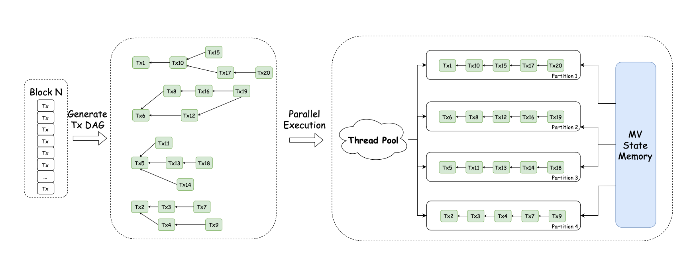
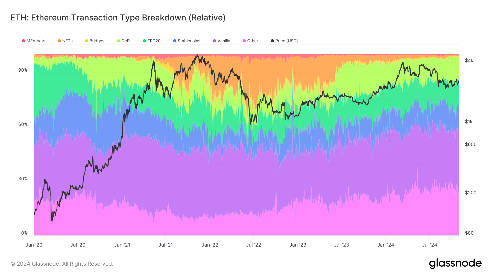
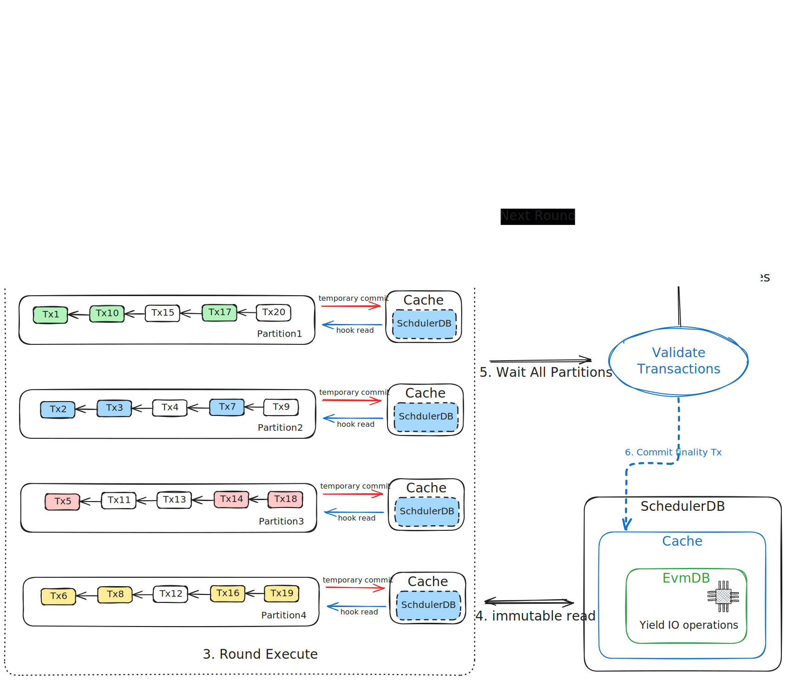

# Grevm

Grevm 1.0 is reth-ready, please see [use-with-reth.md](use-with-reth.md) for more details.

## Introducing Grevm

We are excited to announce the release of [Grevm 1.0 (Gravity EVM)](https://github.com/Galxe/grevm), an open-source,
parallel EVM runtime based on [revm](https://github.com/bluealloy/revm). Grevm's algorithm is inspired by
[BlockSTM](https://arxiv.org/abs/2203.06871), and we've enhanced it by incorporating a transaction data dependency graph
derived from simulation results. This mechanism enables more effective scheduling for parallel execution, minimizing
transaction re-executions.

In our benchmark, Grevm stands as the **fastest** open-source parallel EVM implementation to date. For fully
parallelizable transactions, Grevm is **4.13×** faster than sequential execution, running at **26.50 gigagas/s.** If we
simulate real-world I/O latency of **100 μs**, it is **50.84×** faster than sequential execution, with **6.80
gigagas/s** throughput. This leap in performance is attributed to both the parallelized execution and the integration of
asynchronous I/O operations—enabled by the parallelism—which further amplifies the speedup by efficiently overlapping
I/O operations.

This marks our first step toward the broader vision of **Gravity Chain** and **Gravity SDK**—an open-source,
high-performance Layer 1 blockchain toolkit. **Grevm** is a critical component of this vision, serving as the execution
runtime that enables Gravity Chain to achieve a throughput of 1 gigagas per second, essential for supporting the next
generation of Web3 applications. Together, they provide a modern toolkit for launching restaking-secured,
high-performance EVM Layer 1 solutions, effectively scaling Ethereum.

Grevm's development builds upon and greatly benefits from the pioneering work of several key projects in the blockchain
space. We extend our gratitude to [Paradigm](https://www.paradigm.xyz/) and [ithacaxyz](https://x.com/ithacaxyz) for
[reth](https://github.com/paradigmxyz/reth) & [revm](https://github.com/bluealloy/revm), which form the foundation upon
which Grevm is built. Our sincere thanks go to [Aptos](https://aptoslabs.com/) for their implementation of the
**BlockSTM** algorithm and insightful optimizations implemented in the codebase. Additionally, we are also grateful to
[Rise](https://www.riselabs.xyz/) for their exploration of parallel EVM execution using BlockSTM
([pevm](https://github.com/risechain/pevm)), as well as the **BNB Chain team** for their in-depth exploration of
[parallel EVM performance](https://www.bnbchain.org/en/blog/road-to-high-performance-parallel-evm-for-bnb-chain). These
foundational efforts have been instrumental in shaping Grevm and guiding its design.

Grevm 1.0 is still a PoC implementation, where its known limitations are discussed in the following sections. We are
currently working on the next version of Grevm 2.0, which will be release soon in December 2024.

## Technical Design



_Figure 1: Ideal Parallel Execution_

Before diving into the specifics of our algorithm, it's instructive to consider what an ideal parallel execution would
look like. _Figure 1_ illustrates this perfect scenario, where transactions are processed in parallel without conflicts,
effectively maximizing throughput and resource utilization.

Consider a sequence of transactions ordered as **Tx₁**, **Tx₂**, ..., **Txₙ**. The ideal process involves:

1. **Precise Analysis of Transaction Dependencies**:
   - Transaction dependencies are _accurately_ analyzed and represented using a **Directed Acyclic Graph (DAG)**, which
     captures the data (read-after-write) dependencies between transactions.
   - Specifically, a transaction **Txⱼ** depends on **Txᵢ** (where **j > i**) if and only if **Txⱼ** reads from a
     storage slot that **Txᵢ** writes to. This indicates a true read-after-write dependency.
   - _Example_: If **Tx₃** reads ERC20 balance of Alice that **Tx₂** would modify, **Tx₃** must wait for **Tx₂** to
     complete, ensuring data consistency.
2. **Optimal Distribution of Transactions Across Threads**:
   - The scheduler _optimally_ distribute transactions across multiple threads, balancing the computational
     (CPU-intensive) and input/output (I/O-intensive) workloads.
3. **Parallel Execution on Software Transactional Memory (STM) System**:
   - A high-performance **STM** provides multi-version state access to each thread
   - During execution, each transaction can read the writes of all preceding transactions but not those of subsequent
     ones, effectively avoiding write-after-read hazards.
   - **Write-After-Write Conflict Resolution**:
     - If multiple transactions write to the same storage slot, the STM resolves the conflict by using the value from
       the transaction with the highest sequence number (i.e., the latest transaction in the sequence).
     - This ensures that the final state reflects the correct order of transactions as intended in the original
       sequence.

However, achieving this ideal in live block execution contexts—such as running a validator node or performing block
synchronization—is challenging due to several factors:

- **Unpredictability of Transaction Interactions**: The precise data dependencies and resource requirements of each
  transaction are difficult to determine without sequentially executing them, due to the dynamic nature of
  high-contention transactions, e.g., DEX swaps.
- **Real-Time Analysis Overhead**: Performing exact dependency analysis in real-time introduces significant
  computational overhead, potentially negating the benefits of parallel execution.

Recognizing these limitations, our approach leverages transaction simulation results obtained by running each
transaction against the most recent available state view before execution. These simulations provide estimates of which
storage slots a transaction will read or write, which serves as input to build the data dependency DAG. These hints can
be computed before parallel execution, avoiding introducing additional computational overhead during execution.



_Screenshot 1: Ideal Parallel Execution_

While not all hints are perfectly precise, these simulation-based hints are generally accurate enough for practical
purposes. For instance, on the Ethereum mainnet, by **historical gas usages**, approximately 30% of transactions are
simple Ether transfers, and another 25%-30% are ERC20 token transfers, which typically involve reading and writing to a
limited number of accounts and storage slots. In such transactions, simulation results are consistently accurate.

Building upon these insights, we have developed a **three-phase parallel execution framework** for **Grevm**, a
follow-up work of **Block-STM** model by incorporating data dependency hints from transaction simulations:

- **Phase 1**: **Hint Generation & State Preloading**—Simulate transactions to gather dependency hints and warm-up
  memory cache. This phase can be performed at various points in time, depending on the design of the blockchain. For
  example, when new transactions arrive in the mempool, simulations can be run immediately to prepare dependency hints
  in advance.
- **Phase 2**: **Dependency Analysis**—Transform the dependency hints gathered during the simulation phase into a DAG
  that models the dependencies between transactions. This DAG serves as a roadmap for scheduling transactions in the
  subsequent parallel execution.
- **Phase 3**: **Concurrent Execution with Conflict Resolution**—Execute transactions in parallel using a modified
  BlockSTM algorithm that leverages the dependency DAG generated in Phase 2. Instead of the scheduler selecting
  transactions strictly based on their sequence numbers in the block (e.g., 1, 2, 3, ..., n), it now prioritizes
  transactions according to the DAG to minimize conflicts and reduce the need for re-executions.

## Implementation and Evaluation

### Grevm 1.0: A Proof-of-Concept Implementation



_Figure 2: Grevm 1.0 PoC Implementation_

To validate the above framework and assess their practical impact, we developed **Grevm 1.0** as a preliminary proof of
concept. The source code can be found on our Github: [https://github.com/Galxe/grevm](https://github.com/Galxe/grevm).
Grevm is ready to be integrated with reth, please see
[https://github.com/Galxe/grevm/blob/main/use-with-reth.md](https://github.com/Galxe/grevm/blob/main/use-with-reth.md).

This initial implementation focuses on testing our hypotheses while minimizing engineering complexity. Despite its known
limitations, Grevm 1.0 has demonstrated significant performance improvements in parallel transaction execution.

The three phases of our framework are executed iteratively across multiple rounds (see Figure 2). This iterative
approach simplifies the engineering effort and allows for flexible experimentation. For each round, the above three
phrases is implemented as the following:

1. **Hint Generation**
   - **First Round:** We simulate each transaction against the last known state to gather initial dependency hints,
     specifically the read and write sets.
   - **Subsequent Rounds**: Instead of re-simulating, we use the read and write sets obtained from the previous round's
     execution.
2. **Dependency Analysis**
   - **Dependency Graph Construction**: We construct a dependency graph based on the read and write sets of transactions
     based on hints.
   - **Partitioning Transactions**: We break the DAG into Weakly Connected Components (WCCs). Each WCC represents a
     group of transactions that are interdependent and must be considered together to avoid conflicts.
   - **Greedy Partitioning Algorithm**: We assign these WCCs to partitions using a greedy algorithm
     - The number of partitions is set to **2 × number of CPU cores + 1** to maximize parallelism.
     - Each transaction is assigned a weight based on the estimated gas usage.
     - We aim to distribute the total weight evenly across partitions.
3. **Concurrent Execution**
   - **Execution:** Each partition is executed independently and in parallel using its own executor. Within each
     partition, transactions are executed sequentially to respect intra-partition dependencies. After all partitions
     complete execution, we attempt to merge the changesets from each partition into a single state.
   - **Validation:** We validate transactions by comparing their read sets against the writes from other partitions.
     Transactions are classified into three states:
     - **Finalized**: No conflicts detected, and transaction IDs are sequentially continuous from the last finalized
       transaction.
     - **Unconfirmed**: No conflicts detected, but transaction IDs are not sequentially continuous.
     - **Conflict**: Conflicts are detected; these transactions require re-execution.
   - **Merge:** If all transactions are finalized, exit. Otherwise, we merge all finalized transaction into a new state,
     and go back to step 1 with the remaining unconfirmed and conflict transactions, with their read/write set as the
     updated speculation.

The above phases are repeated for up to **three rounds**. If convergence (i.e., all transactions being finalized) is not
achieved after three rounds, we fallback to sequential execution for the remaining transactions.

Despite its advantages, our simplified implementation has known limitations. By partitioning based on Weakly Connected
Components (WCCs), we treat all data dependencies within a WCC as transitive across all included transactions, which is
overly restrictive. For example, with a hot ratio of 30%—meaning 30% of transactions access a set of common storage
slots—about half of the transactions may be grouped into a single WCC. This significantly limits parallelism, often
reducing it to two or fewer concurrent partitions and underutilizing available resources. Additionally, if dependency
hints are highly inaccurate, the system may fail to resolve conflicts after three rounds of parallel execution and
revert to sequential execution, resulting in worse performance compared to algorithms like BlockSTM, which experience
only about a 30% slowdown in their worst-case scenarios in their benchmark.

## Evaluation

We evaluate the 1.0 implementation with the following setup:

- gcloud n2d-standard-32 32 vCPUs @2450MHz
- Ubuntu 20.04.6 LTS
- cargo 1.81.0 (2dbb1af80 2024-08-20)
- Grevm git commit hash: `ef3f2cb7b43a37f0acd69798d99678a1f1784f62`
- pevm git commit hash: `d48fae90b6ad36ddc5d613ee28ad23214353e81e`
- Benchmark code:
  [https://github.com/Galxe/grevm/blob/main/benches/gigagas.rs](https://github.com/Galxe/grevm/blob/main/benches/gigagas.rs)

To reproduce the benchmark, run

```bash
JEMALLOC_SYS_WITH_MALLOC_CONF="thp:always,metadata_thp:always" NUM_EOA=${NUM_EOA} HOT_RATIO=${HOT_RATIO} DB_LATENCY_US=${DB_LATENCY_US} cargo bench --bench gigagas
```

Replace `${NUM_EOA}`, `${HOT_RATIO}`, and `${DB_LATENCY_US}` with the desired parameters:

- `NUM_EOA`: Number of accounts.
- `HOT_RATIO`: Ratio of transactions accessing common ("hot") account.
- `DB_LATENCY_US`: Simulated database latency in microseconds.

### Gigagas Block Test

We conducted the gigagas block test, a benchmark designed to evaluate the efficiency of parallel execution under varying
workloads and conditions. We reused some portions of the benchmarking code from pevm. Each mock block contains
transactions totaling **1 gigagas** in gas consumption. Note that we use the actual gas consumption of transactions to
calculate the total gas, which accounts for the gas refunds. The transactions include vanilla Ether transfers, ERC20
token transfers, and Uniswap swaps. Pre-state data is stored entirely in-memory to isolate execution performance from
disk I/O variability. To mimic real-world conditions where disk I/O latency can impact performance, we introduced
artificial latency using the `db_latency` parameter.

### Conflict-Free Transactions

We first evaluated our implementation using conflict-free workloads to measure optimal performance. In this scenario,
transactions consist of independent raw transfers, ERC20 transfers, and Uniswap swaps, each involving separate contracts
and accounts to ensure no data dependencies. This setup provides a baseline to assess the maximum achievable performance
improvement through parallel execution without the impact of transaction conflicts.

| Test            | Num Txs | DB Latency | Sequential Execution (ms) | Parallel Execution (ms) | Execution Speedup | Total Gas     | Throughput (Gigagas/s) |
| --------------- | ------- | ---------- | ------------------------- | ----------------------- | ----------------- | ------------- | ---------------------- |
| Raw Transfers   | 47620   | 0          | 155.86                    | 37.73                   | 4.13              | 1,000,020,000 | 26.5                   |
|                 | 47620   | 100us      | 7476.21                   | 146.99                  | 50.84             | 1,000,020,000 | 6.8                    |
| ERC20 Transfers | 33628   | 0          | 285.64                    | 63.88                   | 4.47              | 906,276,572   | 14.19                  |
|                 | 33628   | 100us      | 10636.06                  | 208.94                  | 50.87             | 906,276,572   | 4.34                   |
| Uniswap Swaps   | 6413    | 0          | 679.99                    | 82.71                   | 8.22              | 1,000,004,742 | 12.09                  |
|                 | 6413    | 100us      | 24440.75                  | 420.91                  | 58.06             | 1,000,004,742 | 2.38                   |

_Table 1: Grevm 1.0 Conflict-Free Transaction Execution Speedup_

Under conflict-free conditions, parallel execution with Grevm 1.0 showed significant speedup compared to sequential
execution, especially when simulated I/O latency was introduced. For raw transfer, we observed a 4.13x speed up and when
DB access latency is 100us, we achieved a 50.84x speedup. Similar results can be found for ERC20 transfers and uniswap
swaps.


_Figure 3: IO Latency v.s. Speedup, Hot Ratio = 0%_

The introduction of I/O latency amplified the performance advantages of parallel execution. While sequential execution
suffers from increased latency due to its linear processing nature, parallel execution mitigates this effect by
overlapping I/O operations across multiple threads. See Figure 3.

|                 | Num Txs | DB Latency | Sequential Execution pevm (ms) | Parallel Execution pevm (ms) | Execution Speedup | Throughput (Gigagas/s) |
| --------------- | ------- | ---------- | ------------------------------ | ---------------------------- | ----------------- | ---------------------- |
| Raw Transfers   | 47620   | 0          | 156.47                         | 55.488                       | 2.82              | 18.02                  |
|                 | 47620   | 100us      | 7484.1                         | 259.18                       | 28.88             | 3.85                   |
| ERC20 Transfers | 33628   | 0          | 278.24                         | 65.127                       | 4.27              | 15.35                  |
|                 | 33628   | 100us      | 10628                          | 683.13                       | 15.55             | 1.46                   |
| Uniswap Swaps   | 6413    | 0          | 665.96                         | 33.787                       | 19.71             | 29.59                  |
|                 | 6413    | 100us      | 26368                          | 839.49                       | 31.4              | 1.19                   |

_Table 2: pevm Benchmark Result of Conflict-Free Transaction Execution_

To compare Grevm with the vanilla BlockSTM algorithm, we ran
[the same benchmark](https://github.com/risechain/pevm/pull/398) using **pevm**. For conflict-free workloads, Grevm
should theoretically perform similarly, which is confirmed in our tests with raw and ERC20 transfers. However, the
integration of asynchronous I/O in Grevm allows for better utilization of system resources, leading to significantly
superior performance when I/O latency is present. For Uniswap transactions, Grevm's results are slower because the state
merging part remains sequential in the current implementation. It introduces many unnecessary copies, and when
changesets are large, e.g. Uniswap transactions, these copies significantly slow down the execution. But since this
component will be completely reworked in the upcoming 2.0 implementation, we will not optimize it in the current
version.

We noticed that some transactions in our benchmark may refund gas, e.g. when ERC20 balances become zero. The refunded
gas are not accounted for in the total gas in our case, which may lead to a slight discrepancy in the throughput
calculation with pevm. We will conduct a more detailed analysis in the future.

For a fair comparison, The above test result of _Table 1_ excludes certain overheads

- **State Bundling**: The time spent creating bundle states from cache states is not included, as this is a necessary
  step for interfacing with the **reth** API but is not present in other implementations' benchmarks.
- **Initial Hint Parsing and Partitioning**: When integrated with pipelined blockchain, the time taken for the initial
  simulation and transaction partitioning is also excluded, because they will be ready before the start of execution.

But even with the above overheads, the total speedup is still considerably significant, especially when DB latency is
non-zero, see Table 3.

| Test            | Num Txs | DB Latency | Sequential Total (ms) | Parallel Total (ms) | Total Speedup | Total Gas     | Throughput (Gigagas/s) |
| --------------- | ------- | ---------- | --------------------- | ------------------- | ------------- | ------------- | ---------------------- |
| Raw Transfers   | 47620   | 0          | 190.12                | 69.176              | 2.75          | 1,000,020,000 | 14.46                  |
|                 | 47620   | 100us      | 7512.8                | 179.03              | 41.96         | 1,000,020,000 | 5.59                   |
| ERC20 Transfers | 33628   | 0          | 317.13                | 96.559              | 3.28          | 906,276,572   | 9.39                   |
|                 | 33628   | 100us      | 10673                 | 243.27              | 43.87         | 906,276,572   | 3.73                   |
| Uniswap Swaps   | 6413    | 0          | 719.08                | 108.2               | 6.65          | 1,000,004,742 | 9.24                   |
|                 | 6413    | 100us      | 24485                 | 439.89              | 55.66         | 1,000,004,742 | 2.27                   |

_Table 3: Grevm 1.0 Conflict-Free Transaction E2E Total Speedup_

### Contention Transactions

In this gigagas block test, we introduce the concept of a **hot ratio** to simulate contention in transaction workloads.
This parameter allows us to model skewed access patterns, where certain accounts or contracts are accessed more
frequently than others.

- **Number of User Accounts**: **100,000** accounts used in the test.
- **Hot Ratio**: Defines the probability that a transaction will access one of the hot accounts.
  - **Hot Ratio = 0%**: Simulates a uniform workload where each read/write accesses random accounts.
  - **Hot Ratio > 0%**: Simulates a skewed workload by designating 10% of the total accounts as **hot accounts**. Each
    read/write operation has a probability equal to the hot ratio of accessing a hot account.

We also introduced a a test set called **Hybrid**, consisting of

- **60% Native Transfers**: Simple Ether transfers between accounts.
- **20% ERC20 Transfers**: Token transfers within three ERC20 token contracts.
- **20% Uniswap Swaps**: Swap transactions within two independent Uniswap pairs.

| Test            | Num Txs | Total Gas     |
| --------------- | ------- | ------------- |
| Raw Transfers   | 47,620  | 1,000,020,000 |
| ERC20 Transfers | 33,628  | 1,161,842,024 |
| Hybrid          | 36,580  | 1,002,841,727 |

_Table 4: Contention Transactions Execution Test Setup_

| Test            | DB Latency | Sequential Execution(ms) | Parallel Execution(ms) | Execution Speedup | Throughput (Gigagas/s) |
| --------------- | ---------- | ------------------------ | ---------------------- | ----------------- | ---------------------- |
| Raw Transfers   | 0          | 207.25                   | 77.05                  | 2.69              | 12.98                  |
|                 | 100us      | 9610.52                  | 217.2                  | 44.29             | 4.6                    |
| ERC20 Transfers | 0          | 316.57                   | 92.63                  | 3.42              | 12.54                  |
|                 | 100us      | 12233.27                 | 263.9                  | 46.38             | 4.4                    |
| Hybrid          | 0          | 295.44                   | 206.71                 | 1.43              | 4.85                   |
|                 | 100us      | 10327.62                 | 1334.9                 | 7.73              | 0.75                   |

_Table 5: Grevm 1.0 Contention Transactions Execution Speedup (hot ratio = 0%)_

| Test            | DB Latency | Sequential Execution(ms) | Parallel Execution(ms) | Execution Speedup | Throughput (Gigagas/s) |
| --------------- | ---------- | ------------------------ | ---------------------- | ----------------- | ---------------------- |
| Raw Transfers   | 0          | 208.05                   | 77.86                  | 2.67              | 12.84                  |
|                 | 100us      | 9632.2                   | 217.31                 | 44.33             | 4.6                    |
| ERC20 Transfers | 0          | 313.59                   | 94.28                  | 3.33              | 12.32                  |
|                 | 100us      | 12289.76                 | 270.19                 | 45.5              | 4.3                    |
| Hybrid          | 0          | 294.52                   | 204.64                 | 1.44              | 4.9                    |
|                 | 100us      | 10333.63                 | 1315.46                | 7.85              | 0.76                   |

_Table 6: Grevm 1.0 Contention Transactions Execution Speedup (hot ratio = 10%)_

| Test            | DB Latency | Sequential Execution(ms) | Parallel Execution(ms) | Execution Speedup | Throughput (Gigagas/s) |
| --------------- | ---------- | ------------------------ | ---------------------- | ----------------- | ---------------------- |
| Raw Transfers   | 0          | 194.95                   | 171.65                 | 1.14              | 5.83                   |
|                 | 100us      | 8879.44                  | 4328.08                | 2.05              | 0.23                   |
| ERC20 Transfers | 0          | 313.48                   | 92.07                  | 3.41              | 12.62                  |
|                 | 100us      | 11434.4                  | 438.03                 | 26.14             | 2.65                   |
| Hybrid          | 0          | 292.63                   | 220.14                 | 1.33              | 4.56                   |
|                 | 100us      | 9742.6                   | 1874.7                 | 5.19              | 0.53                   |

_Table 7: Grevm 1.0 Contention Transactions Execution Speedup (hot ratio = 30%)_


_Figure 4: Hot Ratio v.s. Speedup_


_Figure 5: Hot Ratio v.s. Speedup, Latency=100us_

When the **hot ratio** is **0%**, representing a uniform workload, Grevm 1.0 maintains high levels of parallelism and
shows significant performance improvements over sequential execution.

As the hot ratio increases (e.g., **hot ratio ≥ 30%**), we observe a noticeable decrease in parallel execution
performance. It is an expected behavior as it is related to a known issue of 1.0 implementation, that it only
parallelizes execution between WCC of transaction dependencies. All transactions within a WCC are executed sequentially
within the same partition, even if many transactions are actually independent. With a hot ratio of 30%, there's a 51%
chance that a transaction will involve a hot account, calculated by `1−(1−0.3)^2=0.51` . With **10%** of accounts
(10,000) designated as hot accounts, which is much less than the number of transactions (47620), this results in over
half of the transactions being interconnected through shared hot accounts, forming a large partition. Consequently, the
execution becomes bottlenecked by an abnormally long tail in one partition, significantly reducing overall parallelism
and performance.

This issue will be addressed in the upcoming Grevm 2.0, allowing independent transactions within a WCC to be executed
concurrently.

## Future work

### More Detailed Analysis

With the implementation of Grevm 1.0, we can conduct more detailed analyses to further evaluate our future design.

- **Memory Footprint and DoS Vulnerability**: Evaluate the memory usage to identify any potential vulnerabilities to
  Denial-of-Service attacks due to excessive memory consumption.
- **Re-execution Counts and CPU Utilization**: Compare the number of re-executions and overall CPU usage with other
  implementations. Grevm is expected to use fewer CPU cycles because of reduced re-executions.
- **Dependency Hint Accuracy**: Collect statistics on dependency hint errors, analyzing false positives and false
  negatives to understand their impact of parallelism and the number of executions.

### Grevm 2.0


_Figure 5: Grevm 2.0_

Grevm 2.0 will address the limitations of version 1.0 by introducing:

- **Finer-Grained Transaction-Level Concurrency**: This enhancement allows transactions with shared dependencies to
  execute in parallel once those dependencies are finalized. It overcomes the limitation where such transactions were
  previously executed serially, significantly improving parallelism and resource utilization, especially in
  high-contention workloads.
- **Fully Asynchronous I/O**: Grevm 2.0 will implement true asynchronous I/O throughout the system—from the underlying
  database to the multi-version state memory. This eliminates redundant coroutine context switches associated with
  non-I/O operations in the current implementation, enhancing execution efficiency and reducing latency.

## Authors

[https://github.com/Richard](https://github.com/Richard19960401)

[https://github.com/AshinGau](https://github.com/AshinGau)

[https://github.com/nekomoto911](https://github.com/nekomoto911)

[https://github.com/stumble](https://github.com/stumble)
